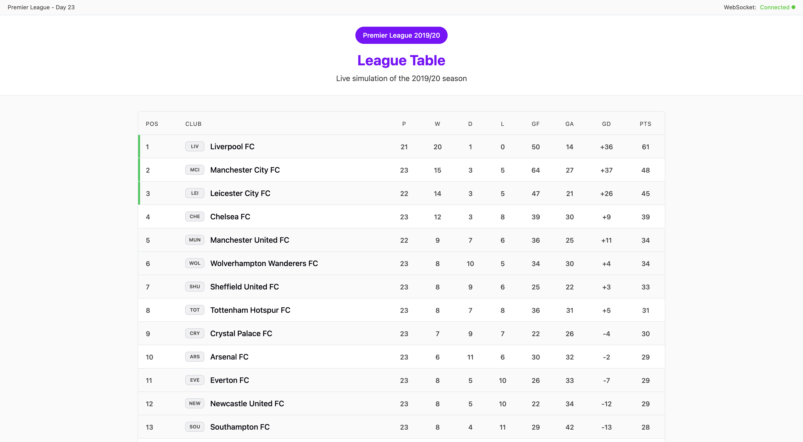
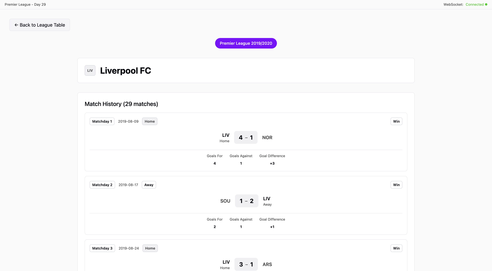

# Mollybet Frontend Take-Home

_Developed by **Alba Casas** as the first stage of the interviewing process for the Frontend Engineer role at Colet Systems_

---

## Result Screenshots

Quick preview of the implemented solution

### League Table


### Team History Page


---

## Original Instructions  

As a sports trading platform we deal with lots of live sports data. We have created a take home task that reflects this. It should take you between one to two hours to complete.

## Tasks

1. Using React and Typescript we would like you to create a table, similar to the [Google Premier League Table](https://www.google.com/search?q=premier+league+table&oq=premier+league+table#sie=lg;/g/11sk7gnh6c;2;/m/02_tc;st;fp;1;;;) which displays the position of football teams in the Premier League. A Premier League season is made up of 20 teams who each play every other team twice. On a win a team receives 3 points, on a draw 1 point, and on a loss 0 points. Match data from the 2019/2020 Premier League season will be sent over a websocket. The websocket is located at `ws://localhost:65000/matches/ws`. The match data is sent in batches according to match days and the premier league table should update in real time as this data is received over the websocket. A score sent as a tuple [2,1] means the home team scored two goals and the away team scored 1.

2. In addition to the table, we would like you to create a page that lists a team's match history similar to the [Google Team History](https://www.google.com/search?q=premier+league+table&oq=premier+league+table#sie=t;/m/02b0xq;2;;mt;fp;1;;;). This page should be navigated to by clicking on the team in the league table.

In the data we send to you:

Clubs have the properties:

- `code`
- `name`
- `country`

Matches have the properties:

- `round`
- `competition`
- `date`
- `home`
- `away`
- `score`

There is a backend with `GET` endpoints to retrieve club information - e.g. the codes assigned to the different clubs. These are documented at `http://localhost:65000/docs` (once you have started the `docker compose` instance).

At the end of the season the websocket will receive a message saying "season finished" and will be disconnected.

Fetch requests may fail and some of the data received over the websocket may vary. This is deliberate as we would like to see how you handle these issues.

## Running the stack

You will need docker compose in order to run the stack. You can check if you have it installed using `docker compose version` which should show you your version information:

```
mollybet-frontend-takehome => docker compose version
Docker Compose version v2.39.1-desktop.1
```

If you don't have it installed you can follow the documentation here: (https://docs.docker.com/compose/install/)

Once it is installed, from inside the top level directory, you should be able to run:

1. `docker compose build`, to initially build the images
2. `docker compose up`, to run both the backend and frontend

(or just do both at the same time with `docker compose build && docker compose up`)

When this is running, you should be able to access the backend on `http://localhost:65000` and the frontend on `http://localhost:65001`. Both should automatically rebuild when you save (but you will have have to reload the page to see them in your browser). You should be able to do this task only editing the files inside `frontend/src`, however if you are welcome to change other files if you like.

Packages installed are minimal. You can add additional packages using `npm install ...` but you will have to re-run the above commands for them to work in the build.

## What we are looking for

- Modern React and javascript practices including strong typing with typescript and functional components using hooks.
- A clean interface that clearly displays the club positions and information.
- A logical and performant handling of state data.

## What would be nice to see

- An eye for design.
- Good file management and separation of concerns.
- Easy to read and highly maintainable code.

## When you are done

Once you have finished, please zip your solution (the whole premier-league folder, preferably delete node_modules before doing so) and send it back to us so we can review your code. Please do not upload your solution to GitHub as we do not want other candidates to copy existing solutions.
